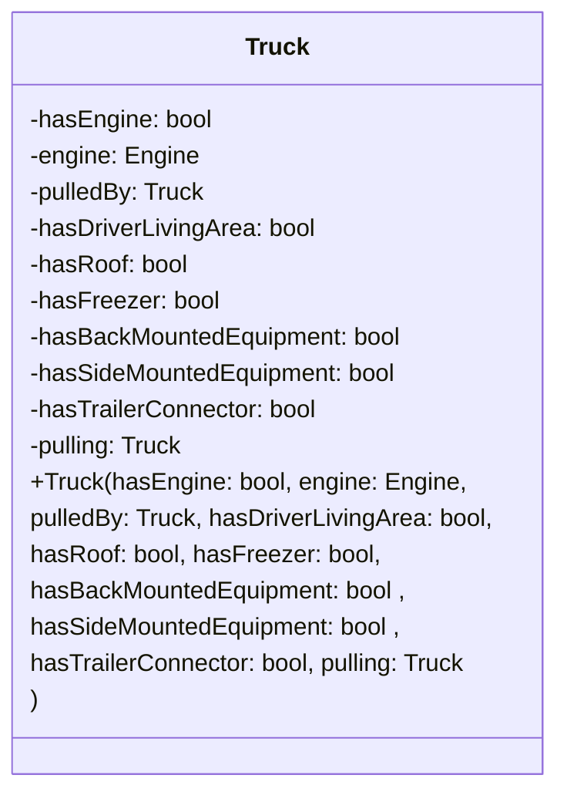
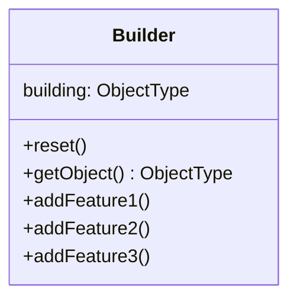

# The Builder design pattern

## Problem

Suppose there is an generic object, which has a great diversity in concrete implementation, that is, the object has a great amount of attributes that need to be specified by programmer. For example, a generic class `Truck` can has many variation:

- Has engine
- is pulled by another truck
- Has driver's accommodation
- Has roof
- Has freezer
- Has back mounted equipment
- Has side mounted equipment
- Has trailer connector to pull other trucks
- Has spare wheels compartment
- etc

Each of the these attributes might be also an object, which further complexify the creation of `Truck`.

## The naive solution

To construct the concrete objects that can cover all of these variations, a solution is that we create a class for each of them. However, it is impractical since for each combination of attributes, we need a concrete class for them. Therefore, the number of classes that we need to declare increases exponentially.

Another solution is that we can let the constructor construct the object itself. However, to provide enough information to build up such object, the number of parameter needed is large, thus make the code less readable with long constructor call.
To shorten it, we can use the default parameters. However, default parameters only allow us to omit a continuous block of arguments at the end. Therefore, omitting some argument in the middle is not an option with this approach. Moreover, there are cases where some argument are rarely used throughout the development, thus it is questionable of if the corresponding parameter helps with construction of object.

An example for this is

## The design pattern

This design pattern further extends the latter solution mentioned in the previous section. The construction of the generic class is controlled by middlemans, called the Builders.

The Builders provide an interface for programmer to build up complex objects with short and clean code. Typically, programmers interact with interfaces provided to create object steps by steps. In this way, programmers don't need to specify argument that is defaulted to values i.e. 0 for element that does not exist in the object or nullptr for pointer that is not going to be used.

Multiple builders also help with different implementation of building the object by controlling and encapsulating some argument of the original constructor. For example, in `BuilderEngineV8` class, the method `addEngine()` will make the truck has the V8 engine, but in the class `BuilderRocketEngine`, the method `addEngine()` will assemble the rocket engine to the truck.

The general structure of a Builder class is:

