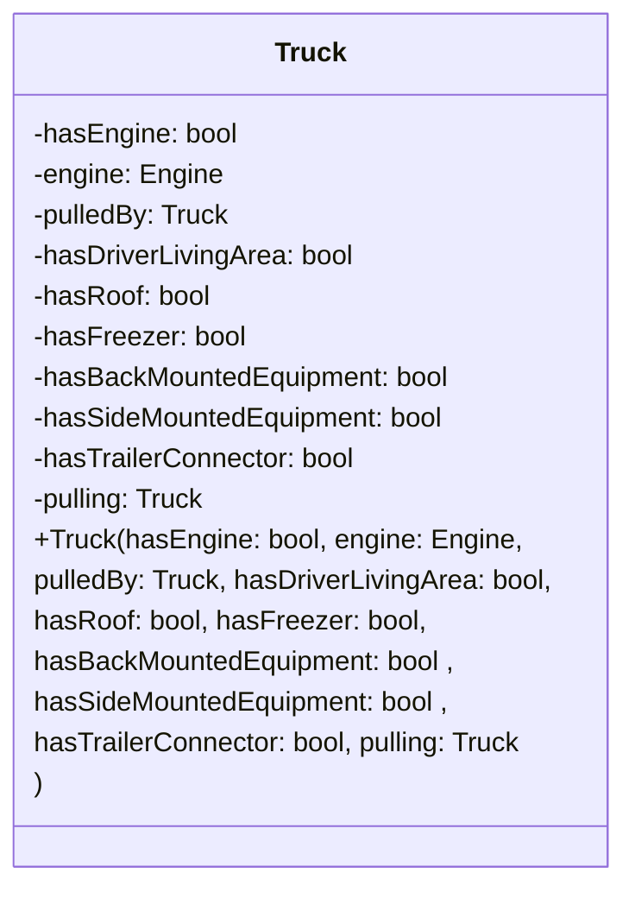
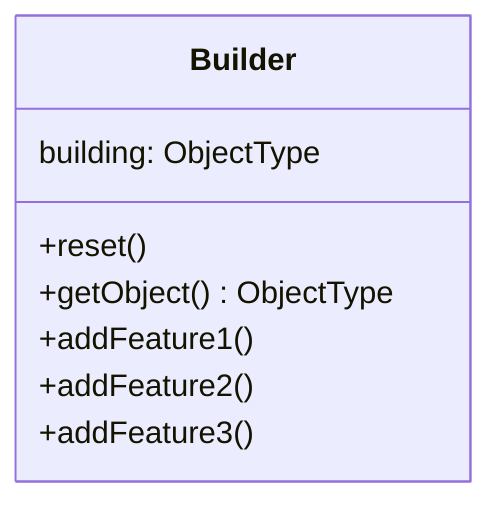
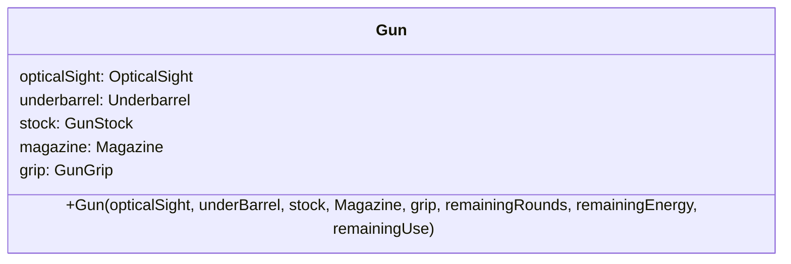
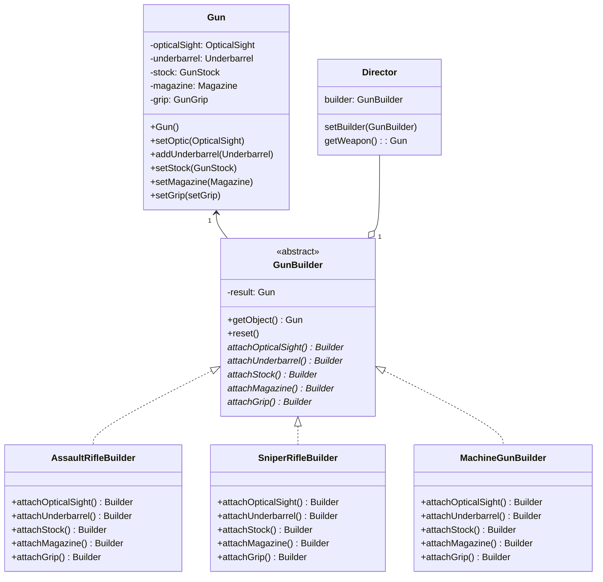

# Builder

## Problem

Suppose there is an generic object, which has a great diversity in concrete implementation, that is, the object has a great amount of attributes that need to be specified by programmer. For example, a generic class `Truck` can has many variation:

- Has engine
- is pulled by another truck
- Has driver's accommodation
- Has roof
- Has freezer
- Has back mounted equipment
- Has side mounted equipment
- Has trailer connector to pull other trucks
- Has spare wheels compartment
- etc

Each of the these attributes might be also an object, which further complexify the creation of `Truck`.

## The naive solution

To construct the concrete objects that can cover all of these variations, a solution is that we create a class for each of them. However, it is impractical since for each combination of attributes, we need a concrete class for them. Therefore, the number of classes that we need to declare increases exponentially.

Another solution is that we can let the constructor construct the object itself. However, to provide enough information to build up such object, the number of parameter needed is large, thus make the code less readable with long constructor call.
To shorten it, we can use the default parameters. However, default parameters only allow us to omit a continuous block of arguments at the end. Therefore, omitting some argument in the middle is not an option with this approach. Moreover, there are cases where some argument are rarely used throughout the development, thus it is questionable of if the corresponding parameter helps with construction of object.

An example for this is

## The design pattern

This design pattern further extends the latter solution mentioned in the previous section. The construction of the generic class is controlled by middlemans, called the Builders.

The Builders provide an interface for programmer to build up complex objects with short and clean code. Typically, programmers interact with interfaces provided to create object steps by steps. In this way, programmers don't need to specify argument that is defaulted to values i.e. 0 for element that does not exist in the object or nullptr for pointer that is not going to be used.

Multiple builders also help with different implementation of building the object by controlling and encapsulating some argument of the original constructor. For example, in `BuilderEngineV8` class, the method `addEngine()` will make the truck has the V8 engine, but in the class `BuilderRocketEngine`, the method `addEngine()` will assemble the rocket engine to the truck.

The general structure of a Builder class is:

Builders' construction of objects can also be abstracted further with Directors. They are classes that provides methods of invoking a sequence of methods of a builder class and return the result object. Using such methods allows reuse of construction of a particular object throughout the program.

## Report content

1. A realworld problem (that needs your pattern to solve)
1. A naive solution (without your pattern)
1. Some problems occur with your naive solution
1. An introduction about your pattern
1. A general class diagram
1. A class diagram for your problem in step 1
1. The implementation of your pattern
1. Pros and cons of our pattern
1. Some other realworld problems, how the design patterns are applied in web dev, mobile dev
1. Quiz: 5-8 questions, ABCD choices, with small gifts (candies, cakes, hugs, kisses...) for correct answers

### 1. Real world problem

In a shooter game, there are various guns that belong to different types. Each of them can be customized with attachments. For simplicity, we assume every gun has the same set of possible attachments.

A gun can have attachments to be installed on. Some of them might have their own functionality. Some of them might have their tracking data. For example, the optical sight has toggleable lighting and energy left, the underbarrel utility can be used and need to track the remaining uses, magazine can be reloaded and need to keep track of rounds left, etc. . Player can freely customize their weapon, hence there are a lot of variety of guns that we need to deal with.

### 2. Naive solution and their drawbacks

A naive solution for this problem is that we manage the attachment via attributes of the `Gun` class.

With this approach, it is easy to encapsulate all needed data into the `Gun` class.
However, the constructor of this class, if needed all information to initialize them, is too long for a clean and maintainable code.

For example, to create a gun with holographic sight and wooden stock, the constructor is called as
`Gun(holographicSight, nullptr, woodenStock, nullptr, nullptr, numberOfRounds, energy, use)`

As we can expect, there are too much parameter for the constructor. Moreover, it reduces its readability as reader won't know what `nullptr` stands for.

We can use the feature of default parameters to reduce the number of arguments needed to be provided, however this only allows us to omit arguments at the end of the constructor.

The practice of instantiating objects with minimal information and leave the rest for later assignment is a way to reduce the length of the parameter, but there are prone of errors caused by developers accidentally constructing the uninteded object, such as an assault rifle with high-magnification sniper sight and without magazine, rendering it useless. Moreover, if there are any other task that try to use the object when construction via methods are not finished, unwanted consequences might arise.

Another approach is that we use concrete classes to narrow down the amount of using  attributes used for tracking the attachments. With this approach, we need a unified interface to create them as they all are the derived classes of `Gun`. The more specific the concrete classes are, the more classes we need to create, and the longer their names are in order to describe which type of gun will be created with them. For example, the name for the class in the previous example will be `GunOpticalStock`. A name for the class of gun with all attachments possible can be `GunOpticalUnderbarrelStockExMagGrip`. Such classes' names are hard to read hence also reduce the maintainability of the program. Furthermore, the number of classes increases exponentially with the number of attributes that we need to reduce.

### The Builder design pattern

This pattern is about separation of construction of complex objects into sequential steps and manage them with middlemen, called the Builders. They serve as an abstraction layer, hiding the detailed construction of object while providing a unified interface for user to build up the desired object step by step. Moreover, the builders can also enforce some parameter during the construction of object. There might also be multiple builder for one object to construct different subtypes.

To reuse a specific sequence of steps in building an object, we can also use another type of class, called the `Director`. The `Director` provide methods to invoke a sequence of construction steps in the `Builder` associated with it. It can also change the builder used in the sequences, provided that they share the same interface. Hence, the `Director` can also be used to construct different kind of classes if their `Builder` share the same base classes

Example for the real world problem

### Implementation

### Advantage and disadvantage of builder pattern

#### Advantages

- Improve code readability
The methods' names give clear intention of steps being done to build the object versus long constructor call. The code are also self-docuemnted via properly named method.
- Flexible construction
  Can skip unwanted components. With constructor call, the corresponding parameter still need placeholder argument.
- Strict verification of arguments. 
Separate methods allows short and strict validation of an argument before using, ensure the correct combination of components for a specific object.
- High reusability
  Construction of objects are abstracted and encapsulated with features of the programming language. The interface of Builder can be reused to implement concrete classes, which will construct variants of the object.
- Easy maintainance and debugging
  Construction of the object is visible to those who have responsibility. Other programming have only access to the interface of Builder, whose inner logic might change to accommodate to the change in the object.Therefore, change to construction does not affect other part of the program.

### Disadvantage

- Higher code complexity
More classes are to be created to realize the pattern. In the interface of the Builder and its implementation, there are repetitive methods for construction steps.

- Decreased performance
Virtual methods cost slightly more resource compared to normal methods. The builders need memory to store the intermediate object.

- Complex implementation
Is not needed for simple objects or those who constructor are easy to understand. The design pattern also take times to be fully implemented, and there are more code to maintain.

- Prone to logical error
If the retrieval of object from the Builder is not controlled, the result object might raise error when being used. However, controlling these aspects require more attribute to trace the property, which add up to memory cost. Programmer might forget to call the `reset()` method between each construction, which might lead to unwanted behaviour of the objects.

### Conclusion

The builder design pattern is a tool to simplify and increase code readability of object whose constructors are complex. By creating one or more abstraction layers, the pattern make the process of construction objects simple, self-documenting and easy to test. However, these advantages come with a trade of performance and code complexity.

