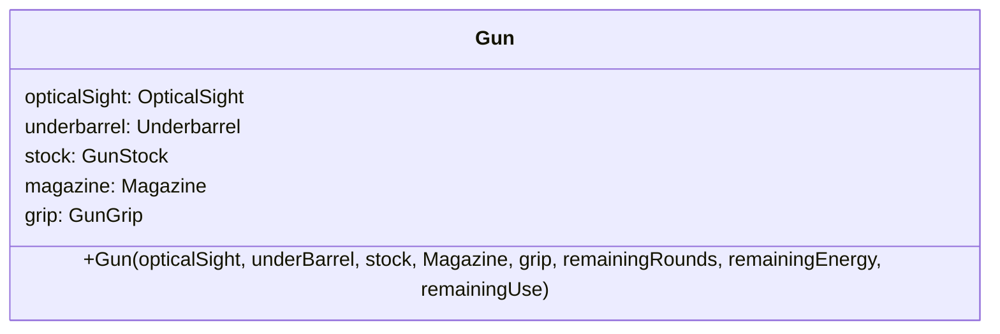
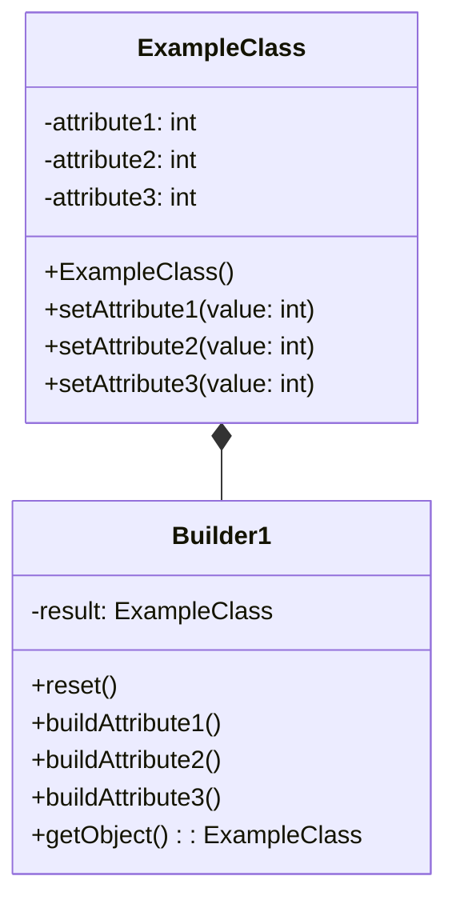
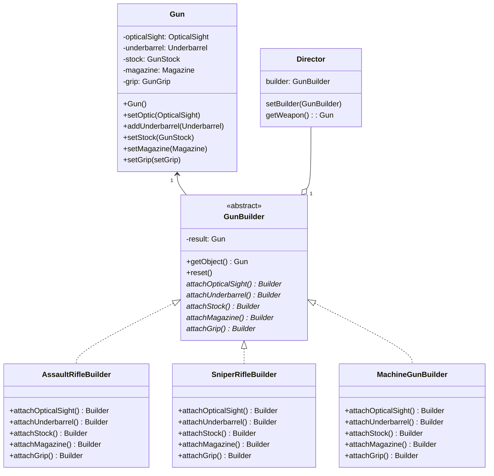

# Builder

## 1. Real world problem

In a shooter game, there are various guns that belong to different types. Each of them can be customized with attachments. For simplicity, we assume every gun has the same set of possible attachments.

A gun can have various attachments installed on it. Some of them might have their own functionality. Some of them might have their tracking data. For example, the optical sight has toggleable lighting and energy left, the underbarrel utility can be used and need to track the remaining uses, magazine can be reloaded and need to keep track of rounds left, etc. . Player can freely customize their weapon, hence there are many varieties of guns that we need to deal with.

## 2. Naive solution and their drawbacks

A naive solution for this problem is that we manage the attachment via attributes of the `Gun` class.



With this approach, it is easy to encapsulate all needed data into the `Gun` class.
However, the constructor of this class, if needed all information to initialize them, is too long for a clean and maintainable code.

For example, to create a gun with holographic sight and wooden stock, the constructor is called as
`Gun(holographicSight, nullptr, woodenStock, nullptr, nullptr, numberOfRounds, energy, use)`

As we can expect, there are too many parameters for the constructor. Moreover, it reduces its readability as readers won't know what `nullptr` represents.

We can use the feature of default parameters to reduce the number of arguments needed to be provided, however this only allows us to omit arguments at the end of the constructor.

The practice of instantiating objects with minimal information and leaving the rest for later assignment is a way to reduce the length of the parameter, but there is a risk of errors caused by developers accidentally constructing the unintended object, such as an assault rifle with high-magnification sniper sight and without magazine, rendering it useless. Moreover, if there is any other task that try to use the object when construction via methods are not finished, unwanted consequences might arise.

Another approach is that we use concrete classes to reduce the number of attributes being used to track attachments. With this approach, we need a unified interface to create them as they all are the derived classes of `Gun`. The more specific the concrete classes are, the more classes we need to create, and the longer their names are in order to describe which type of gun will be created with them. For example, the name for the class in the previous example will be `GunOpticalStock`. A name for the class of gun with all attachments possible can be `GunOpticalUnderbarrelStockExMagGrip`. Such classes' names are hard to read hence also reduce the maintainability of the program. Furthermore, the number of classes increases exponentially with the number of attributes that we need to reduce.

## The Builder design pattern

This pattern is about separation of construction of complex objects into sequential steps and manage them with middlemen, called the Builders. They serve as an abstraction layer, hiding the detailed construction of object while providing a unified interface for user to build up the desired object step by step. Moreover, the builders can also enforce some parameter during the construction of object. There might also be multiple builder for one object to construct different subtypes.

To reuse a specific sequence of steps in building an object, we can also use another type of class, called the `Director`. The `Director` provides methods to invoke a sequence of construction steps in the `Builder` associated with it. It can also change the builder used in the sequences, provided that they share the same interface. Hence, the `Director` can also be used to construct different kinds of classes if their `Builder` share the same interface.



## Apply to the original problem

We create the class `Gun`, which serve as the generic class which represents all guns used in the game. The `Gun` class should provide a constructor that initialize the object with minimal information and methods that allow user to change the components that the gun use.

Then, we create an interface named `GunBuilder`. Inside, we declare concrete methods for retrieval of object and resetting the object being constructed. Other methods for attaching components are declared as *virtual* functions. They will be implemented in inherited classes.

Optionally, the `Director` class can also be implemented. The `Director` will hold one instance of the `GunBuilder` and provide methods to change the builder used and to retrieve the product.



## Implementation

### Basic Gun Class

```cpp
class Gun {
private:
    OpticalSight* opticalSight;
    Underbarrel* underbarrel;
    GunStock* stock;
    Magazine* magazine;
    GunGrip* grip;
    
public:
    Gun() : opticalSight(nullptr), underbarrel(nullptr), 
            stock(nullptr), magazine(nullptr), grip(nullptr) {}
    
    void setOpticalSight(OpticalSight* sight) { opticalSight = sight; }
    void setUnderbarrel(Underbarrel* under) { underbarrel = under; }
    void setStock(GunStock* st) { stock = st; }
    void setMagazine(Magazine* mag) { magazine = mag; }
    void setGrip(GunGrip* gr) { grip = gr; }
    
    // Display gun configuration
    void displayConfiguration() const;
};
```

### Abstract Builder

```cpp
class GunBuilder {
protected:
    Gun* result;
    
public:
    GunBuilder() {result = new Gun();}
    virtual ~GunBuilder() = default;
    
    void reset() {
        delete result;
        result = new Gun();
    }
    
    Gun* getObject() {
        Gun* gun = result;
        result = nullptr;
        return gun;
    }
    
    virtual GunBuilder& attachOpticalSight() = 0;
    virtual GunBuilder& attachUnderbarrel() = 0;
    virtual GunBuilder& attachStock() = 0;
    virtual GunBuilder& attachMagazine() = 0;
    virtual GunBuilder& attachGrip() = 0;
};
```

### Concrete Builders

```cpp
class AssaultRifleBuilder : public GunBuilder {
public:
    GunBuilder& attachOpticalSight() override {
        result->setOpticalSight(new HolographicSight());
        return *this;
    }
    
    GunBuilder& attachUnderbarrel() override {
        result->setUnderbarrel(new VerticalGrip());
        return *this;
    }
    
    GunBuilder& attachStock() override {
        result->setStock(new AdjustableStock());
        return *this;
    }
    
    GunBuilder& attachMagazine() override {
        result->setMagazine(new StandardMagazine(30));
        return *this;
    }
    
    GunBuilder& attachGrip() override {
        result->setGrip(new HandheldGrip());
        return *this;
    }
};

class SniperRifleBuilder : public GunBuilder {
public:
    GunBuilder& attachOpticalSight() override {
        result->setOpticalSight(new SniperScope());
        return *this;
    }
    
    GunBuilder& attachUnderbarrel() override {
        result->setUnderbarrel(new Bipod());
        return *this;
    }
    
    GunBuilder& attachStock() override {
        result->setStock(new PrecisionStock());
        return *this;
    }
    
    GunBuilder& attachMagazine() override {
        result->setMagazine(new PrecisionMagazine(10));
        return *this;
    }
    
    GunBuilder& attachGrip() override {
        result->setGrip(new SniperGrip());
        return *this;
    }
};
```

### Director Class

```cpp
class Director {
private:
    GunBuilder* builder;
    
public:
    Director(GunBuilder* b) : builder(b) {}
    
    void setBuilder(GunBuilder* b) { builder = b; }
    
    Gun* buildBasicWeapon() {
        builder->reset();
        return builder->attachMagazine()
                     .attachStock()
                     .getObject();
    }
    
    Gun* buildFullyEquippedWeapon() {
        builder->reset();
        return builder->attachOpticalSight()
                     .attachUnderbarrel()
                     .attachStock()
                     .attachMagazine()
                     .attachGrip()
                     .getObject();
    }
    
    Gun* buildCustomWeapon() {
        builder->reset();
        return builder->attachOpticalSight()
                     .attachStock()
                     .attachMagazine()
                     .getObject();
    }
};
```

### Usage Example

```cpp
int main() {
    // Create builders
    AssaultRifleBuilder arBuilder;
    SniperRifleBuilder sniperBuilder;
    
    // Create director
    Director director(&arBuilder);
    
    // Build assault rifle with full equipment
    Gun* assaultRifle = director.buildFullyEquippedWeapon();
    
    // Switch to sniper rifle builder
    director.setBuilder(&sniperBuilder);
    Gun* sniperRifle = director.buildCustomWeapon();
    
    // Manual building without director
    arBuilder.reset();
    Gun* customGun = arBuilder.attachOpticalSight()
                             .attachMagazine()
                             .getObject();
    
    // Clean up
    delete assaultRifle;
    delete sniperRifle;
    delete customGun;
    
    return 0;
}
```

## Advantage and disadvantage of builder pattern

### Advantages

- **Improve code readability**: The methods' names give clear intention of steps being done to build the object versus long constructor call. The code are also self-documented via properly named method.
- **Flexible construction**: Can skip unwanted components. With constructor call, the corresponding parameter still need placeholder argument.
- **Strict verification of arguments.**: Separate methods allows short and strict validation of an argument before using, ensure the correct combination of components for a specific object.
- **High reusability**: Construction of objects are abstracted and encapsulated with features of the programming language. The interface of Builder can be reused to implement concrete classes, which will construct variants of the object.
- **Easy maintenance and debugging**: Construction of the object is visible to those who have responsibility. Other programming have only access to the interface of Builder, whose inner logic might change to accommodate to the change in the object.Therefore, change to construction does not affect other part of the program.

### Disadvantage

- **Higher code complexity**: More classes are to be created to realize the pattern. In the interface of the Builder and its implementation, there are repetitive methods for construction steps.

- **Decreased performance**: Virtual methods cost slightly more resource compared to normal methods. The builders need memory to store the intermediate object.

- **Complex implementation**: The pattern is not needed for simple objects or those of which constructors are easy to understand. The design pattern also takes time to be fully implemented, and there are more code to maintain.

- **Prone to logical error**: If the retrieval of object from the Builder is not controlled, the result object might raise error when being used. However, controlling these aspects require more attributes to trace the property, which add up to memory cost. Programmers might forget to call the `reset()` method between each construction, which might lead to unwanted behaviour of the objects.

## Conclusion

The builder design pattern is a tool to simplify and increase code readability of object whose constructors are complex. By creating one or more abstraction layers, the pattern makes the process of construction objects simple, self-documenting and easy to test. However, these advantages come with a trade of performance and code complexity.
