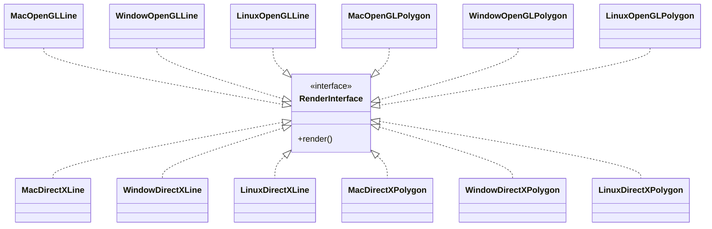
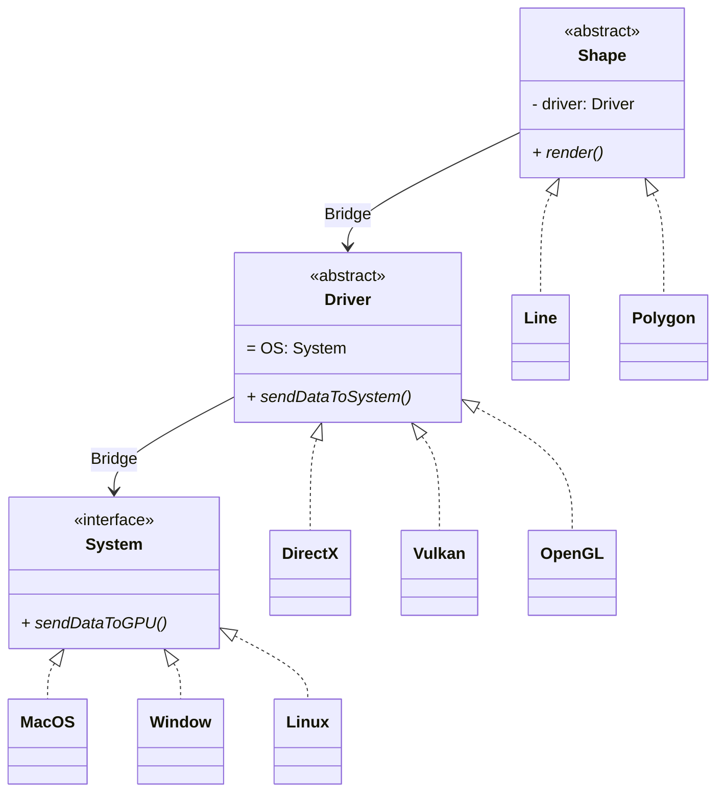

# Bridge

## Introduction

Suppose we are designing a renderer that can work across multipe drivers as well as multiple operating system with just an interface for user to call for.

## Naive solution

We implement concrete classes corresponding to each combination of platform and operating system. In each class, we implement the suitable rendering method.

The structure can be visualized in the following UML diagram

In reality, this solution is impractical when the number of drivers, platforms or shape rises as there are multiples classes for just one shape. Not only there are more work to cover such classes, the cost of maintaining and debugging them also skyrockets due to duplicated code and tight coupling of diffrent logics.

## The solution with Bridge Pattern

We see that the naive solution coupled the driver, the platform and the shape together. We can instead detach them and let them communicate with each other via designated interfaces.

The bridge pattern is designed to give another solution instead of coupling the abstraction and the implementation of an object. In the aforementioned design pattern, each of them are developed and functions independently, with the implementation designed for the abstraction in mind. This would significantly reduce the number of classes from $N \times M$ ($N$ implementations, $M$ abstractions) to $N + M$.  

## Applying to the original problem

To solve the problem we have introduced in the first section, we separate the classes into shapes, operating systems and drivers specific classes.

## Advantage and disadvantage of the pattern

### Advantage

- Extensible and indepedent relation between abstraction and implementation
The abstraction does not permanently bind to a specific implementation with this pattern. Moreover, the use of abstract classes provides an interface to call for the implementations, which allows the implementation used for an abstraction to be dynamic and can be easily changed during runtime.
- Separation of concern and responsibility
With the separation of abstraction and implementation, or multiple dimension of extension, the functionality for each of them can be made more detailed and specific.  

### Disadvantage

