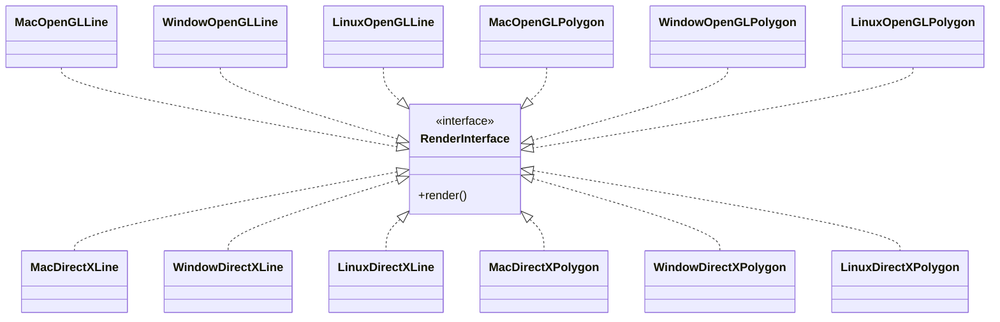
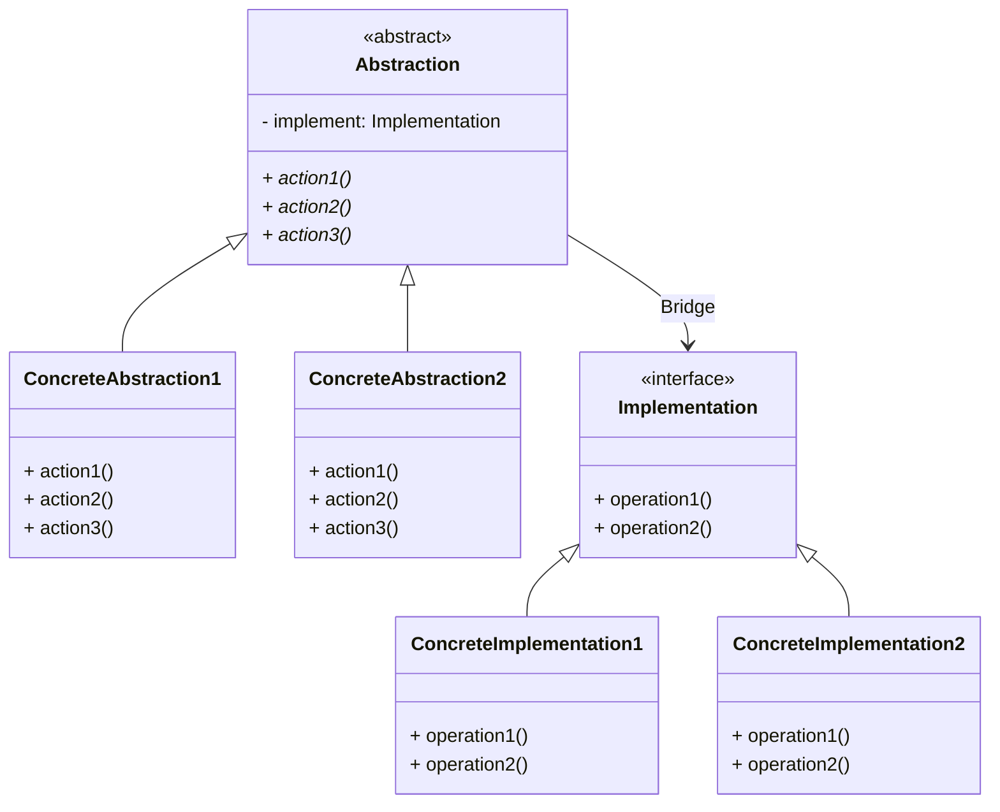
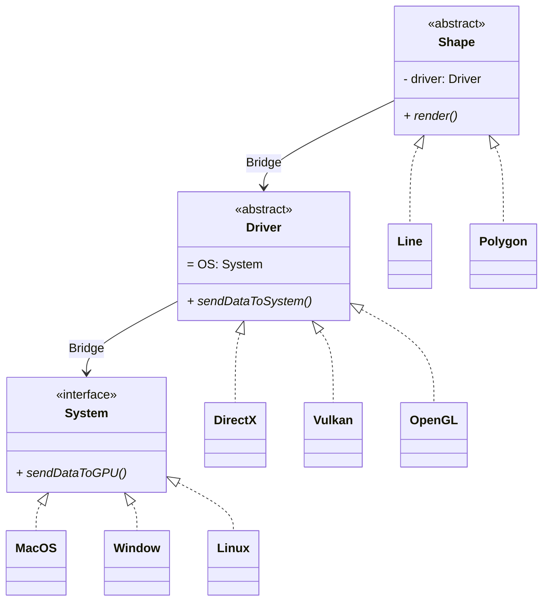

# Bridge

## Introduction

Suppose we are designing a renderer that can work across multipe drivers as well as multiple operating system with just an interface for user to call for.

## Naive solution

We implement concrete classes corresponding to each combination of platform and operating system. In each class, we implement the suitable rendering method.

The structure can be visualized in the following UML diagram



In reality, this solution is impractical when the number of drivers, platforms or shape rises as there are multiples classes for just one shape. Not only there are more work to cover such classes, the cost of maintaining and debugging them also skyrockets due to duplicated code and tight coupling of diffrent logics.

## The solution with Bridge Pattern

We see that the naive solution coupled the driver, the platform and the shape together. We can instead detach them and let them communicate with each other via designated interfaces.

The bridge pattern is designed to give another solution instead of coupling the abstraction and the implementation of an object. In the aforementioned design pattern, each of them are developed and functions independently, with the implementation designed for the abstraction in mind. This would significantly reduce the number of classes from $N \times M$ ($N$ implementations, $M$ abstractions) to $N + M$.  



## Applying to the original problem

To solve the problem we have introduced in the first section, we separate the classes into shapes, operating systems and drivers specific classes.



## Implementation

```cpp
class System {
public:
    virtual ~System() = default;
    virtual void sendDataToGPU(const std::string& data) = 0;
    virtual std::string getSystemName() const = 0;
};

class MacOS : public System {
public:
    void sendDataToGPU(const std::string& data) override {
        std::cout << "MacOS: Sending to Metal GPU - " << data << std::endl;
    }
    std::string getSystemName() const override { return "MacOS"; }
};

class Windows : public System {
public:
    void sendDataToGPU(const std::string& data) override {
        std::cout << "Windows: Sending to DirectX GPU - " << data << std::endl;
    }
    std::string getSystemName() const override { return "Windows"; }
};

class Linux : public System {
public:
    void sendDataToGPU(const std::string& data) override {
        std::cout << "Linux: Sending to OpenGL GPU - " << data << std::endl;
    }
    std::string getSystemName() const override { return "Linux"; }
};

class Driver {
protected:
    std::unique_ptr<System> system;
    
public:
    Driver(std::unique_ptr<System> sys) : system(std::move(sys)) {}
    virtual ~Driver() = default;
    virtual void sendDataToSystem(const std::string& shapeData) = 0;
    virtual std::string getDriverName() const = 0;
    
    void setSystem(std::unique_ptr<System> newSystem) {
        system = std::move(newSystem);
    }
};

class OpenGL : public Driver {
public:
    OpenGL(std::unique_ptr<System> sys) : Driver(std::move(sys)) {}
    
    void sendDataToSystem(const std::string& shapeData) override {
        std::string openglData = "OpenGL_" + shapeData;
        std::cout << "OpenGL Driver processing: " << openglData << std::endl;
        system->sendDataToGPU(openglData);
    }
    
    std::string getDriverName() const override { return "OpenGL"; }
};

class DirectX : public Driver {
public:
    DirectX(std::unique_ptr<System> sys) : Driver(std::move(sys)) {}
    
    void sendDataToSystem(const std::string& shapeData) override {
        std::string directxData = "DirectX_" + shapeData;
        std::cout << "DirectX Driver processing: " << directxData << std::endl;
        system->sendDataToGPU(directxData);
    }
    
    std::string getDriverName() const override { return "DirectX"; }
};

class Vulkan : public Driver {
public:
    Vulkan(std::unique_ptr<System> sys) : Driver(std::move(sys)) {}
    
    void sendDataToSystem(const std::string& shapeData) override {
        std::string vulkanData = "Vulkan_" + shapeData;
        std::cout << "Vulkan Driver processing: " << vulkanData << std::endl;
        system->sendDataToGPU(vulkanData);
    }
    
    std::string getDriverName() const override { return "Vulkan"; }
};

class Shape {
protected:
    std::unique_ptr<Driver> driver;
    
public:
    Shape(std::unique_ptr<Driver> d) : driver(std::move(d)) {}
    virtual ~Shape() = default;
    virtual void render() = 0;
    
    void setDriver(std::unique_ptr<Driver> newDriver) {
        driver = std::move(newDriver);
    }
    
    std::string getConfiguration() const {
        return "Shape -> " + driver->getDriverName() + " -> System";
    }
};

class Line : public Shape {
private:
    float x1, y1, x2, y2;
    
public:
    Line(float x1, float y1, float x2, float y2, std::unique_ptr<Driver> d) 
        : Shape(std::move(d)), x1(x1), y1(y1), x2(x2), y2(y2) {}
    
    void render() override {
        std::string lineData = "Line[" + std::to_string(x1) + "," + std::to_string(y1) + 
                              " to " + std::to_string(x2) + "," + std::to_string(y2) + "]";
        std::cout << "Rendering Line" << std::endl;
        driver->sendDataToSystem(lineData);
    }
};

class Polygon : public Shape {
private:
    int vertices;
    
public:
    Polygon(int v, std::unique_ptr<Driver> d) 
        : Shape(std::move(d)), vertices(v) {}
    
    void render() override {
        std::string polygonData = "Polygon[" + std::to_string(vertices) + " vertices]";
        std::cout << "Rendering Polygon" << std::endl;
        driver->sendDataToSystem(polygonData);
    }
};

int main() {
    // Create a line that uses OpenGL on Linux
    auto line = std::make_unique<Line>(0, 0, 10, 10, 
                    std::make_unique<OpenGL>(
                        std::make_unique<Linux>()));
    
    std::cout << "Configuration: " << line->getConfiguration() << std::endl;
    line->render();
    
    std::cout << "\n" << std::string(50, '-') << "\n" << std::endl;
    
    // Create a polygon that uses DirectX on Windows
    auto polygon = std::make_unique<Polygon>(6,
                        std::make_unique<DirectX>(
                            std::make_unique<Windows>()));
    
    std::cout << "Configuration: " << polygon->getConfiguration() << std::endl;
    polygon->render();
    
    std::cout << "\n" << std::string(50, '-') << "\n" << std::endl;
    
    // Runtime flexibility - change the driver and system
    polygon->setDriver(
        std::make_unique<Vulkan>(
            std::make_unique<MacOS>()));
    
    std::cout << "New Configuration: " << polygon->getConfiguration() << std::endl;
    polygon->render();
    
    return 0;
}
```

## Advantage and disadvantage of the pattern

### Advantage

- **Extensible and indepedent relation between abstraction and implementation**
The abstractions are loosely coupled to implementations instead of permanent binding. The implementation used for each abstraction is flexible and can be easily changed runtime-wise.
- **Separation of concern and responsibility**: Each part of the Bridge pattern has functionality and their range of responsibility smaller. This increase the maintainability of code as it can be easity tested. 
- **Change of implementation at runtime**: This optional ability is important in some system as it allows flexibility in how implementations are used.

### Disadvantage

- **Not a universal solution**: This pattern might backfire when the implementations and abstractions has strict compatibility requirements. To solve this, we need overhead validation of compatibiity. Moreover, if the checking are not conducted fully, runtime error might happens.
- **Slightly worse performance**: The method relies on inheritance and composition, which display worse performance which might be inefficient during work with limited resources

## Conclusion

The bridge pattern is a useful pattern to solve the problem of tight coupling between the different parts of a system. It allows flexible and extensible design which can adapt to changes more easily. However, this comes with a cost of complexity and potential runtime errors if the compatibility between abstractions and implementations are not properly managed.