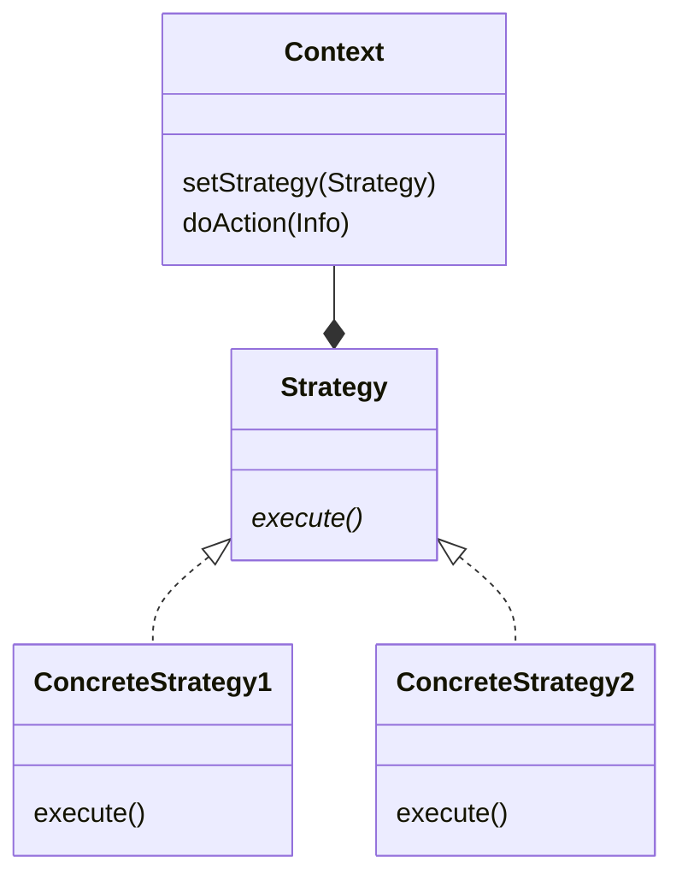
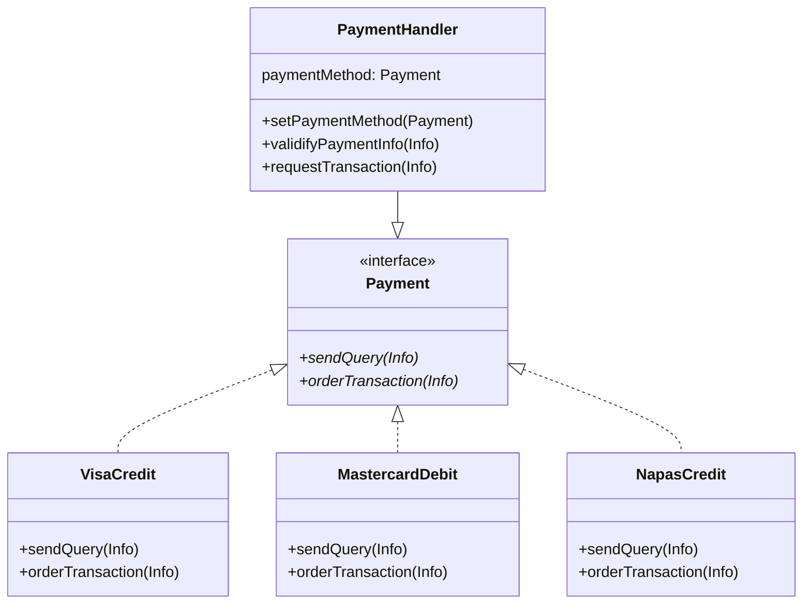

# Strategy 

## Problem

Suppose we are designing a payment system. The system is supposed to accept different payment methods depending on user input: credit card of various issuers, debit card of various issuers, bank account, virtual wallets, etc..

## Naive solution

For each payment method, we create a method inside the class taht is responsible for payment. Each of which accepts the payment method as a parameter.

This solution is impractical as implementing all methods to cover users' need is tedious and will eventually cluster the class declaration and defintion. This also make the class's size become too large, which is an anti-pattern in developing as it bloats the object with unnecessary code in most use case, wasting memory.

## The solution that use the pattern

We create an interface, from which each class that is possible for a task will inherit, called a strategy. Then another class, called the Context class, will have a method that accept the given interface as one of its parameter. The work that the Context class need to do will be delegated to the interface, which in turn call for a strategy to perform a specific task. However, the Context class does not manage the strategy used. Instead, the strategy that will be used will be provided externally, either via a separate method or is passed together with other information.

## Apply to the original problem

First, we create the `PaymentHandler` class that will validate and conduct transaction based on the provided information. Inside, we use an object of interface `Payment`. That class will act as communicator between the `PaymentHandler` and the payment service provider.
The detailed communication protocol for validification and transaction are implemented as strategy for each combination of payment method and provider.

## Pros and Cons of Strategy Pattern

### Pros

- **Open/Closed Principle**: The list of strategies is extensible without modifying existing code
- **Single Responsibility**: Each strategy handles one specific algorithm or behavior
- **Runtime Flexibility**: Can switch strategies dynamically during execution
- **Reduce long conditional logic**: Reduces usage of complex if-else or switch statements
- **Code Reusability**: Strategies can be reused across different contexts
- **Easy Testing**: Each strategy can be tested independently

### Cons

- **Increased Complexity**: More classes and interfaces to maintain.
- **Require understanding of strategies**: Strategies and their meanings must be khow by user in order to be used.
- **Memory Usage**: Additional objects created for each strategy
- **Overkill for Simple Cases**: There are too many implementation, which is not suitable for cases where there are a few option to choose from.  